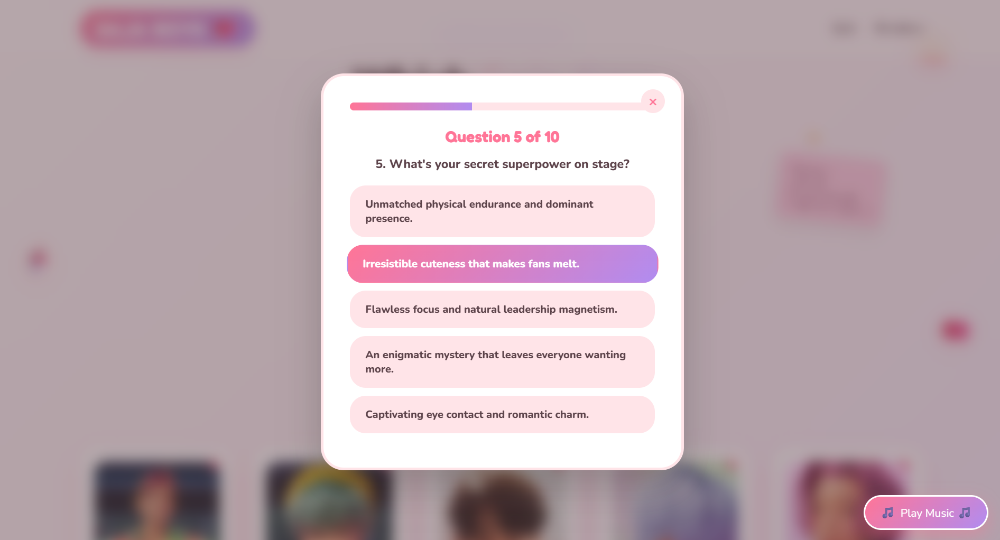
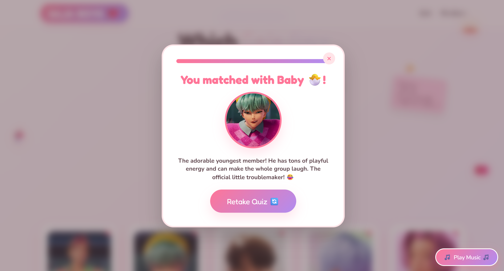

# 🎵 Which Saja Boy Are You?

💗 An interactive personality quiz inspired by the Saja Boys from *KPop Demon Hunters* 🎀✨ 

🌐 **[Live Demo](https://whichsajaboyareyou.netlify.app/)**

## ✨ About

**Which Saja Boy Are You?** is a fan-made interactive personality quiz that matches users with one of five Saja Boys based on their answers to a 10-question quiz.

I built this project to practice frontend development with **HTML, CSS, and JavaScript**, working towards my web dev skills while experimenting with interactive UI design, animations, dynamic content, and client-side quiz logic.

## 🎯 Features

- 📝 10-question personality quiz
- 🧮 Score-based character matching
- 👥 Interactive Saja Boys member cards
- 📖 Member bio pop-ups
- 📊 Quiz progress bar
- 🎵 Background music toggle
- ✨ Animated and responsive UI
- 📱 Mobile-friendly layout
- 🎨 Custom pastel-themed visual design

## 🛠️ Tech Stack

- **HTML5** — page structure and content
- **CSS3** — styling, responsive layouts, animations, and visual effects
- **JavaScript** — quiz logic, scoring, modals, music controls, and dynamic content
- **Netlify** — deployment

## 🧠 How It Works

Each quiz question contains five possible answers, with each answer corresponding to one Saja Boy.

As the user selects an answer, the corresponding character's score is incremented. After all 10 questions are answered, the character with the highest score is selected as the user's match and displayed along with their bio.

The member cards use the same character data to display additional information through interactive pop-ups.

## 📁 Project Structure

```text
which-saja-boy-are-you/
│
├── index.html       # Main webpage structure
├── style.css        # Styling, animations, and responsive design
├── script.js        # Quiz logic and interactive functionality
│
├── abby1.jpg
├── baby.jpg
├── jinu1.jpg
├── mystery1.webp
├── pinkhair.jpg     # Character images
├── favicon.jpg      # Website favicon
│
└── previews/        # Project preview images
    ├── quiz_screen.png
    └── result_screen.png
## 📸 Preview

### Quiz



### Result



## ⚠️ Disclaimer

This is an unofficial, fan-made project created for learning and entertainment purposes.

KPop Demon Hunters, the Saja Boys, characters, names, music, and related intellectual property belong to their respective rights holders. This project is not affiliated with or endorsed by the creators, studios, or rights holders.

## 👨‍💻 Author

Advik Bhat
GitHub: @advik-bhat
